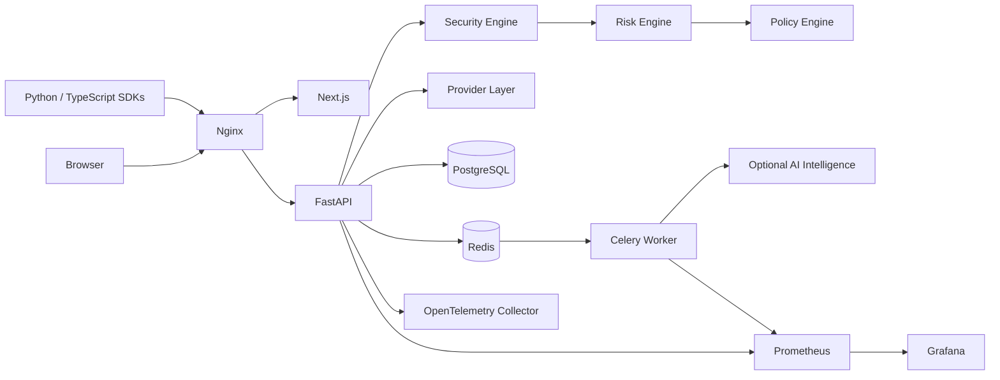
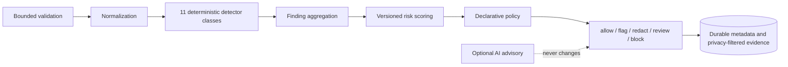
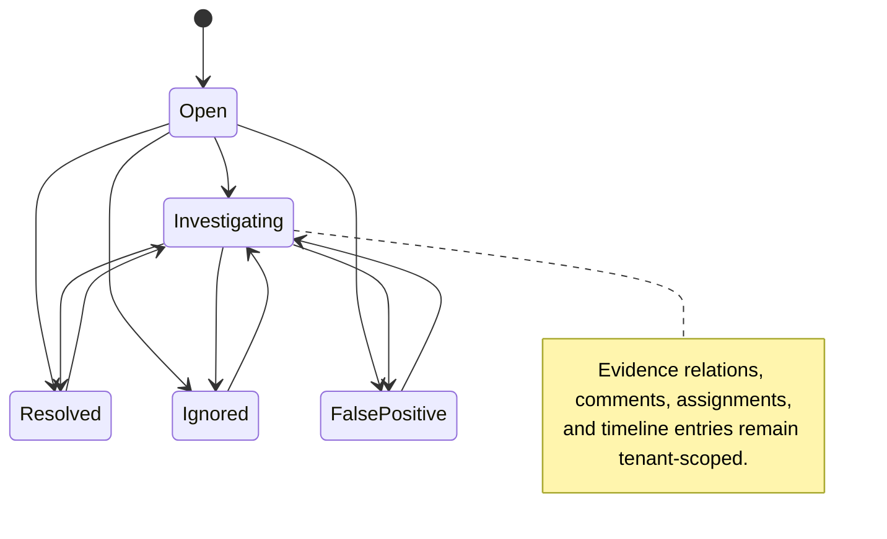
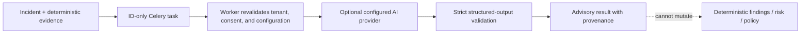
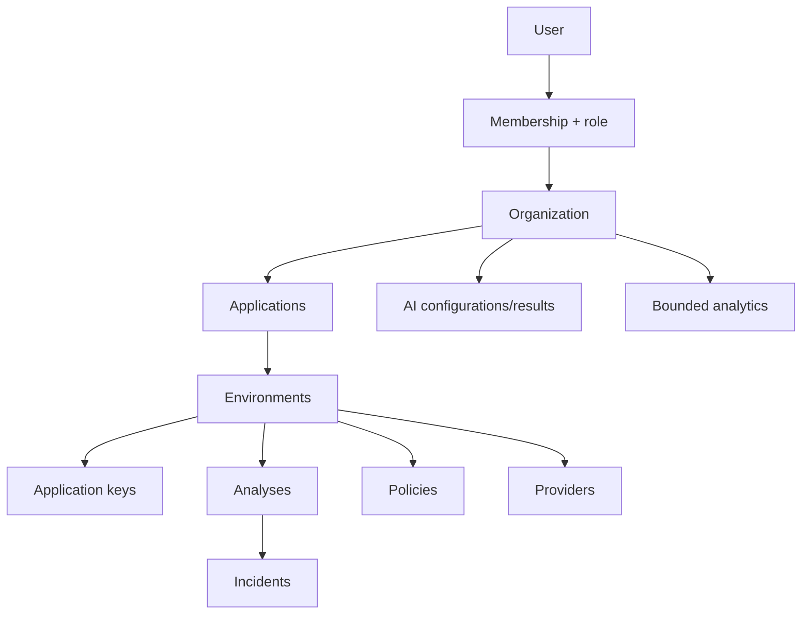
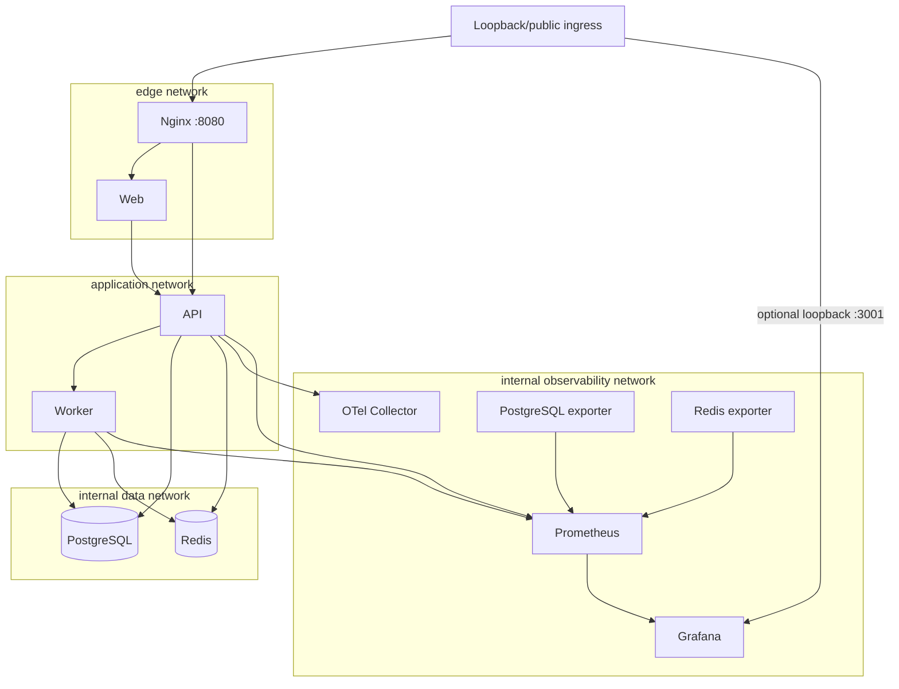
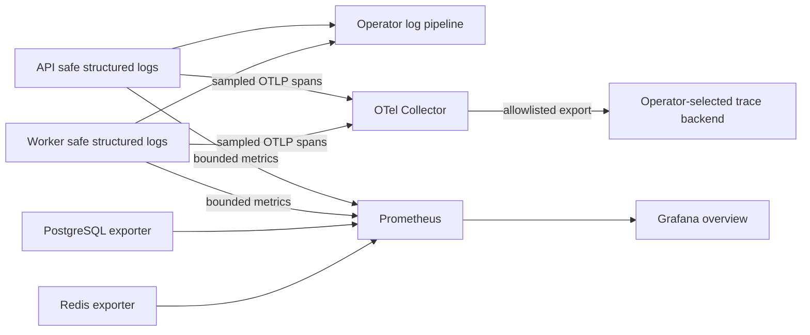

# Renzai architecture

These diagrams describe the frozen V1 implementation. Optional AI stays outside authoritative
enforcement, and arrows do not imply capabilities such as streaming, tools, or autonomous action.

## 1. System architecture



## 2. Analyze security pipeline



## 3. Gateway request flow

```mermaid
sequenceDiagram
  participant C as Application
  participant G as Renzai Gateway
  participant S as Security/Risk/Policy
  participant P as Configured Provider
  C->>G: bounded text chat request
  G->>S: input inspection
  S-->>G: durable input decision
  alt block, review, or inspection failure
    G-->>C: fail closed; no provider call
  else allowed or safely redacted
    G->>P: provider request
    P-->>G: bounded text response
    G->>S: output inspection
    S-->>G: durable output decision
    alt safe enforcement result
      G-->>C: allowed or redacted content
    else block, review, or redaction failure
      G-->>C: provider content withheld
    end
  end
```

## 4. Incident lifecycle



## 5. AI Intelligence flow



## 6. Multi-tenant isolation model



Composite database foreign keys bind environment-, provider-, incident-, and AI-linked records to
the same organization. Service-layer authorization hides foreign-tenant resources rather than
turning identifiers into an oracle.

## 7. Self-hosted deployment



Only Nginx and optional Grafana publish host ports. Production TLS, secret injection, backup,
capacity, and public-ingress policy remain operator responsibilities.

## 8. Observability architecture



Metric labels exclude prompts, request IDs, user IDs, organization IDs, emails, and secrets. Trace
attributes and logs follow the same privacy boundary; observability outages never authorize bypassing
deterministic enforcement.
