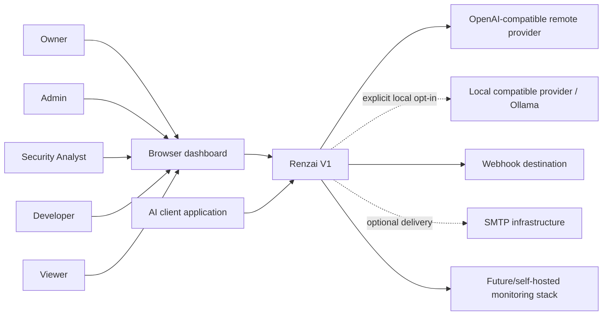

# System context

Renzai is the system of interest. Human roles are organization scoped; the API is the final authorization authority. AI clients use environment-scoped application keys. Browser users use opaque sessions.

| External actor/system | Interaction | Trust and scope |
|---|---|---|
| Owner/Admin/Analyst/Developer/Viewer | Dashboard management, inspection and incident work according to [role matrix](../phase-01/03-personas-and-actors.md) | Browser is untrusted; session plus server RBAC required. |
| AI client application | Analyze and gateway calls | Untrusted request body; scoped application key identifies organization/application/environment. |
| Remote provider | Receives permitted gateway traffic and optional AI analysis requests | External processor; credentials encrypted, destination validated, content disclosure governed. |
| Local provider (e.g. Ollama) | Same abstraction through explicit private-network exception | Self-hosted exception is narrowly configured and audited. |
| Webhook destination | Receives signed event notifications | Untrusted outbound destination; SSRF rules and replay guidance apply. |
| SMTP | Optional invitation/verification delivery | No SMTP dependency for creating invitation links. |
| Monitoring stack | Receives operational telemetry | Receives IDs/aggregates, not raw prompts or provider secrets. |

V1 covers textual prompt/response traffic. Agent runtime and executable tool-call authorization are future scope, even though V1 detectors inspect tool-manipulation *indicators* in text.
