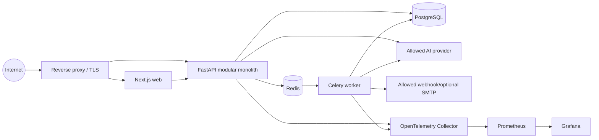

# Container architecture

The diagram shows deployable process groups, not separate domain services. The FastAPI application is one modular monolith; the worker imports its application use cases without exposing a second public API.

| Container | Responsibility / I/O | Trust / owned data | Dependencies, scale and failure |
|---|---|---|---|
| Reverse proxy | TLS termination, routes web/API/gateway, size/time limits | Internet edge; no domain data | Replicate with shared routing. Failure makes public UI/API unavailable. No direct DB/Redis exposure. |
| Web frontend | Dashboard SSR/interactive UI; sends same-origin session requests | Untrusted presentation tier; no provider secrets | Replicable. API failure shows safe errors; UI cannot override authorization. |
| Backend API | Auth, analysis, gateway, policies, incidents, configuration, audit, health/readiness | Trusted domain boundary; owns all domain writes via modules | Replicable if sessions/coordination use shared stores. PostgreSQL unavailable means dependent operations fail safely; Redis impairment must not turn into an allow decision. |
| Background worker | AI explanation, notifications, retention and aggregation | Trusted service identity with tenant-scoped jobs; writes only through owning use cases | Independently scalable by queue. Queue failure delays async effects and must surface operationally; synchronous enforcement remains separate. |
| PostgreSQL | Durable organization, security, session verifier, audit and event data | Highest sensitivity; module-owned logical records | Internal only, backed up. Outage prevents durable reads/writes; readiness reflects dependency. |
| Redis | Celery broker, optional short-lived rate-limit/cache state | Internal transient data; no raw prompt by default | Internal only; loss may delay jobs or rate-limit coordination. Security-critical limits choose conservative fallback. |
| Observability collector/Prometheus/Grafana | Receive traces, metrics and dashboards | Operational metadata only | Optional monitoring path; outage does not alter security outcome. Not a source of product security findings. |

Provider, webhook and SMTP endpoints are external systems, not Renzai containers. See [deployment topology](14-deployment-architecture.md) for exposure and persistence expectations.
