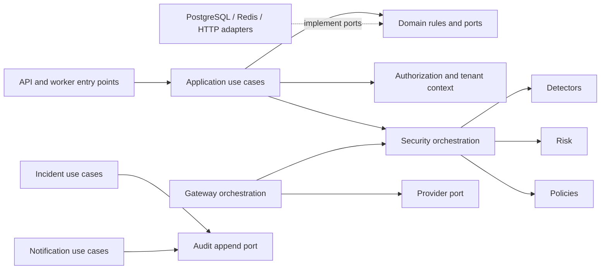

# Domain module architecture

Each named module is an internal package boundary in one backend. “Public interface” means typed application operations/events, not a network endpoint. Domain rules are pure where possible; use cases orchestrate them; infrastructure adapters satisfy outbound ports. No module reads another module's private persistence representation or imports its infrastructure. Shared types are limited to stable IDs, tenant context, clock and error primitives; a general shared business layer is forbidden.

## Dependency direction

Arrows name use-case calls, not import permission to another module's private models. Authz is supplied at the use-case boundary from `auth`/`memberships`. `security` owns orchestration and depends on pure `detectors`, `risk`, and a policy evaluation port; `gateway` calls `security` and `providers`. Policies do not call gateway or import security orchestration. Events connect incident, audit, notification and analytics consumers without reverse imports. The only allowed domain dependency cycle is **none**.

## Module contracts

Every entry gives: responsibility and owned concepts; permitted public calls/events; forbidden direct dependencies; security/persistence notes; Phase 1 references. “Consumes” refers to in-process or queued application events, not a distributed bus.

| Module | Responsibility / owned concepts | Public interface; emits / consumes | Allowed → forbidden | Security / persistence ownership | References |
|---|---|---|---|---|---|
| auth | Login, opaque sessions, reset/verification credential lifecycle | `authenticate`, `require_session`, `revoke_session`; emits `SessionRevoked`, consumes `MembershipChanged` | users read port and membership status read port → no membership writes or provider internals | Session verifiers and reset tokens; Argon2, CSRF, rotation | FR-001–006; SEC-001,003,005,024; US-001 |
| users | Personal identity/profile | `get_user`, `change_profile`; emits `UserChanged`, consumes none | shared identity primitives → no auth session or tenant business internals | User identity; password ownership coordinated with auth use cases | FR-001,004; SEC-001,004; US-001 |
| organizations | Organization lifecycle/settings | `create_org`, `update_org`; emits `OrganizationChanged`, consumes none | shared tenant/actor context → no memberships, security findings or provider internals | Organization root and defaults; use case delegates last-owner invariant to memberships | FR-007–008; SEC-004; US-002 |
| memberships | Invitations, roles, membership | `require_role`, `invite`, `change_role`; emits `MembershipChanged`, consumes `OrganizationChanged` | organizations identity port and shared token primitives → no auth session, incident or provider internals | Membership and lifecycle-controlled invitation-token records; cross-tenant and last-owner checks | FR-009–012; SEC-004,024; US-003–004 |
| applications | Application lifecycle, privacy settings | `create_app`, `set_privacy`; emits `ApplicationChanged`, consumes org status | organizations, authorization → no gateway provider calls | Application and storage-policy settings | FR-013,051–053; SEC-004,023; US-005,026 |
| environments | Development/staging/production context | `resolve_environment`, `set_environment`; emits `EnvironmentChanged`, consumes application status | applications IDs → no security decision internals | Environment and fail-safe configuration | FR-014,046; SEC-014; US-005,023 |
| api_keys | Environment-scoped credentials | `issue`, `verify`, `revoke`, `rotate`; emits `ApiKeyRotated`, consumes environment status | environments and authz → no user sessions | Key verifier/prefix/expiry/last-use; one-time display | FR-015–019; SEC-002,011,018,024; US-006,027 |
| security | Bounded analysis orchestration/findings | `analyze(input, context)`; emits `ThreatDetected`, consumes policy/profile versions | detectors, risk, policy port → no provider dependency | Analysis/finding concepts and safe evidence | FR-020–021,027,041; SEC-007,010; US-007,011 |
| detectors | Deterministic detector set and versions | `run(normalized_input)`; emits findings, consumes none | pure normalization primitives → no DB, provider or policy | Detector definitions/versioned rule assets | FR-022–026; SEC-007; US-009–010,028–029 |
| risk | Versioned score/profile interpretation | `score(findings, profile)`; emits `RiskCalculated`, consumes findings | detector result types → no persistence or provider | Scoring profiles and result contribution metadata | FR-029–030; SEC-025; US-007,028 |
| policies | Bounded condition evaluation/actions | `evaluate(context, findings, phase)`; emits `PolicyChanged` on admin use cases, consumes analysis facts | shared immutable analysis-fact contract and actor context → no security orchestration, gateway or detector implementation | Policy definitions/versions and decision rationale | FR-031–033; SEC-004,015; US-012–014 |
| incidents | Triage, status, assignee, timeline | `create`, `assign`, `transition`; emits `IncidentCreated`, `IncidentStatusChanged`, consumes `ThreatDetected` when configured | security findings snapshot, memberships → no provider transport | Incident/timeline; tenant context and safe evidence | FR-034–036; SEC-004,023; US-015–017 |
| logs | Security event record/query | `record_event`, `search_events`; emits `SecurityEventRecorded`, consumes analysis decisions | privacy policy port → no raw provider secrets | Event records per storage/retention mode | FR-037–038; SEC-010,023; US-019 |
| providers | Configured provider and outbound adapter | `configure`, `forward`, `health_validate`; emits `ProviderChanged`, consumes none | outbound URL guard, secret vault → no detector/policy internals | Encrypted credential references, model/base URL config | FR-042; SEC-012,020–021; US-021 |
| gateway | Limited chat-completion orchestration | `complete`; emits `GatewayRequestCompleted`, consumes security decisions | security, providers, api_keys → no direct detector DB | No separate durable store; redacted request record via logs | FR-044–046; SEC-007,016,017; US-008,023 |
| ai_intelligence | Optional incident summaries/explanations | `request_explanation`; emits `AiAnalysisCompleted`, consumes incident snapshot | provider port, incidents read port → no enforcement-policy write | Labelled AI output, privacy-controlled | FR-041,043; SEC-010,012; US-022,024 |
| audit | Append-only security action history | `append`, `query`; emits `AuditAppended`, consumes approved security events | tenant/actor context → no mutating another module | Audit records and safe metadata; correction appends | FR-047–048; SEC-015,023; US-025 |
| notifications | In-app and signed webhook delivery | `notify`, `manage_destination`; emits `WebhookDeliveryRequested`, consumes incident/policy events | outbound guard, membership read port → no incident writes | Notification/destination/delivery state | FR-049–050,056; SEC-019–022; US-030–031 |
| analytics | Tenant-scoped dashboard aggregates | `dashboard_summary`; emits none, consumes `SecurityEventRecorded` / incident changes | logs/incidents read models → no raw prompt storage | Aggregate views with tenant/time boundaries | FR-039; SEC-004,023; US-018 |

Event subscriptions are explicit. An unlisted subscription is forbidden; callers use public query interfaces for current state rather than treating an event as an authorization fact.

| Module | Emits | Consumes |
|---|---|---|
| auth | `SessionRevoked` | `MembershipChanged` for session invalidation |
| users | `UserChanged` | None |
| organizations | `OrganizationChanged` | None |
| memberships | `MembershipChanged` | `OrganizationChanged` for lifecycle reconciliation |
| applications | `ApplicationChanged` | `OrganizationChanged` for lifecycle reconciliation |
| environments | `EnvironmentChanged` | `ApplicationChanged` for lifecycle reconciliation |
| api_keys | `ApiKeyRotated` | `EnvironmentChanged` for scope invalidation |
| security | `ThreatDetected` | None; reads selected policy/profile versions synchronously |
| detectors | None; returns findings to caller | None |
| risk | None; returns score to caller | None |
| policies | `PolicyChanged` | None; synchronous evaluation receives findings as input |
| incidents | `IncidentCreated`, `IncidentStatusChanged` | `ThreatDetected` when auto-creation is configured |
| logs | `SecurityEventRecorded` | None; direct use case records privacy-filtered event |
| providers | `ProviderChanged` | None |
| gateway | `GatewayRequestCompleted` | None; directly invokes security/provider ports |
| ai_intelligence | `AiAnalysisCompleted` | Explicit analyst request job |
| audit | `AuditAppended` | Security-sensitive lifecycle events, selected by audit policy |
| notifications | `WebhookDeliveryRequested` | `IncidentCreated`, `IncidentStatusChanged`, `PolicyChanged` |
| analytics | None | `SecurityEventRecorded`, incident changes |

Events are notifications of committed facts. Consumers re-fetch through the owning module and revalidate tenant scope before side effects. Synchronous call edges in the diagram remain acyclic; asynchronous event reactions must not re-enter their producer to mutate the same fact recursively.

## Consistency rule

An owning module commits its state and any required audit/outbox record in one PostgreSQL transaction. Cross-module readers use public query interfaces. Security decisions are synchronous and cannot await Celery delivery. Eventual consumers may lag; the dashboard must label freshness where it matters.
