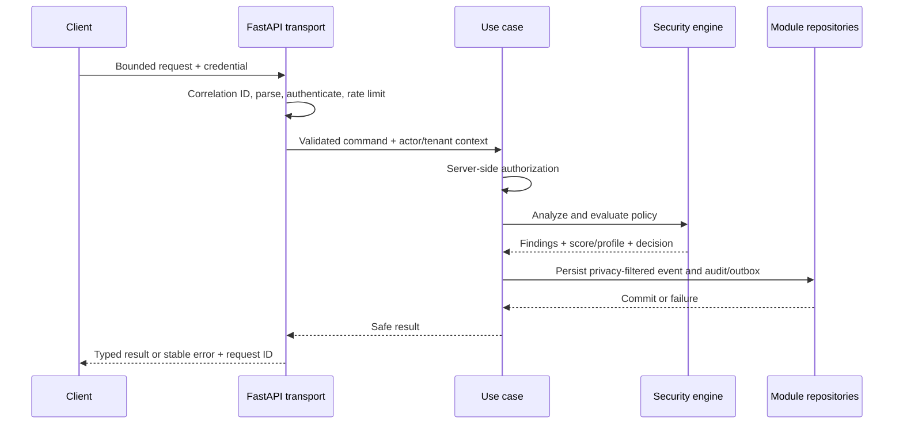

# Backend architecture

The FastAPI application is a modular monolith. The same use cases are invoked from HTTP routes and Celery tasks; transport handlers do not own business rules.

## Layers and dependency inversion

| Layer | Responsibility | Dependency rule |
|---|---|---|
| API/transport | Route grouping, request IDs, authentication selection, bounded parsing, response/error serialization | Calls application use cases only. No direct SQL or detector decisions. |
| Application/use cases | Transaction boundaries, authorization, tenant context, orchestration, event recording and outbox dispatch | Depends on domain rules and ports; never on concrete outbound client types. |
| Domain | Detector contracts, risk/policy evaluation, invariants, incident transitions | Pure or clock/ID abstractions; no FastAPI/SQLAlchemy/Redis import. |
| Persistence | Async SQLAlchemy repositories and unit of work | Implements module-owned ports; PostgreSQL is source of truth. Alembic is reserved for later migration design. |
| Infrastructure | Provider/webhook HTTP, encryption, Redis broker/limits, telemetry | Implements explicit outbound ports and enforces destination policies. |
| Small shared kernel | Tenant/actor context, immutable IDs, correlation ID, safe error type | No shared mutable business state or universal repository. |

FastAPI dependency injection wires request-scoped actor, tenant, configuration, unit of work and port implementations. Wiring happens at the composition root; domain code receives interfaces, not global service locators.

## Request lifecycle

The synchronous security path runs before event persistence; a failed required commit must not be disguised as successful logging or enforcement. The eventual API contract will specify when analysis may return after a logging failure; staging/production gateway decisions cannot become `allow` because the inspection subsystem failed.

## Transactions and sessions

Create one async DB session and unit of work per request/use case; the owner module controls writes. Commit domain changes, required audit record and outbox entry atomically. Publish queued events only after commit through an outbox dispatcher. Roll back on failure; no network provider call while holding a transaction open. Worker tasks establish their own unit of work with validated tenant context. Use parameterized ORM access and explicit tenant predicates. No shared request session is stored globally.

## Error architecture

Errors expose a stable machine code, safe human message and correlation ID. Production responses omit stack traces, raw payloads, secrets and internal URLs. Proposed taxonomy: `validation`, `authentication`, `authorization`, `tenant_not_found_or_hidden`, `rate_limit`, `policy_block`, `provider_timeout`, `provider_error`, `inspection_failure`, `configuration_error`, `conflict`, `internal_error`. The Phase 3 API contract will specify exact HTTP mappings and response schemas; authorization should avoid confirming inaccessible tenant object existence.

## Configuration and secure data

Typed startup validation distinguishes application, security, PostgreSQL, Redis, session, encryption-key, CSRF, CORS, rate-limit, outbound-network, provider, logging, observability, feature-flag and environment behavior settings. Invalid security-critical configuration prevents readiness. Non-secret settings may come from environment variables; secret values enter through protected environment/secret-manager references with rotation planning. Credentials are never logged or returned. Deployment-specific payload limits, timeout values and key rotation schedules need Phase 3 configuration specification. Rate limiting must have a conservative fallback if its shared store fails.

## Background dispatch

Use cases write outbox intents for optional AI work, notifications, webhooks and analytics. A dispatcher submits tenant-scoped Celery jobs after commit; job IDs and correlation IDs support idempotency and diagnosis. Synchronous authorization, analysis and policy evaluation never depend on queue availability. See [runtime](12-runtime-and-background-jobs.md).

## Architecture-level API boundary catalog

This is a resource grouping, not a route or request/response schema. `Session` means browser session plus CSRF for writes; `key` means environment-scoped application key.

| Group | Purpose | Actor/auth | Tenant scope and key security concern |
|---|---|---|---|
| auth | Register/login/logout/reset/verification | Human / session or credential flow | Rate limits, enumeration prevention, CSRF, session lifecycle |
| organizations | Organization settings | Owner/Admin / session | Actor membership and ownership boundary |
| memberships | Invitations/roles/removal | Owner/Admin / session | Last-owner invariant, one-time invitation, audit |
| applications | Lifecycle/privacy | Owner/Admin/Developer / session | Organization isolation, safe defaults |
| environments | Stage selection and config | Owner/Admin/Developer / session | Fail-safe production defaults |
| keys | Issue/rotate/revoke | Owner/Admin/Developer / session | One-time secret display, expiry, audit |
| analyze | Synchronous prompt/response analysis | AI client / key; playground human / session | Bounded content, application/environment binding, privacy |
| policies | Rule configuration | Owner/Admin/Analyst / session | Bounded syntax, priority, version, audit |
| incidents | Investigation/status | Role matrix / session | Tenant and assignee checks, safe evidence |
| logs | Event search | Role matrix / session | Tenant filter and storage mode |
| providers | Config and validation | Owner/Admin / session | Encrypted secret, SSRF guard |
| gateway | Limited chat completions | AI client / key | Input/output enforcement, stable failure |
| audit | Security action query | Authorized roles / session | Append-only, privacy, no raw secrets |
| notifications | In-app messages | Authorized human / session | Recipient and tenant isolation |
| webhooks | Destination lifecycle | Owner/Admin / session | SSRF, signing secret, replay, audit |
| analytics | Dashboard aggregates | Authorized human / session | Tenant-scoped aggregation |
| health/readiness | Process/dependency status | Operator/probe according to deployment | Minimal information exposure; no credential leaks |

OpenAPI documentation covers implemented platform endpoints (FR-054); publishing access and exact HTTP contract are Phase 3 decisions.
