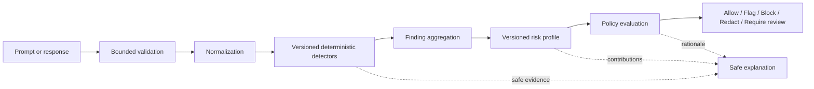
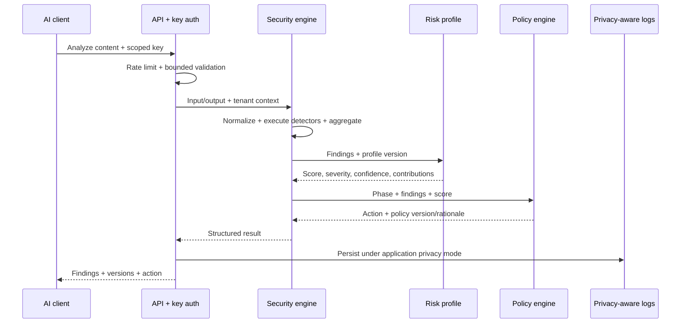

# Security engine architecture

The synchronous deterministic engine is shared by Analyze API, Gateway input/output and Playground. It never requires an AI provider. Its result is a versioned, explainable input to policy evaluation.

## Detector contract

A detector receives normalized, bounded content, direction (`input` or `output`), and a restricted context. Its output concept includes detector ID/version, category, direction, severity contribution, confidence, evidence locator or safe excerpt, safe explanation, and non-secret metadata. It may emit zero or more findings. It does not decide policy, persist raw text, call a provider or mutate a score. Execution must be deterministic for identical input and versioned configuration. Normalization records a version and preserves safe mapping to source spans for redaction, subject to privacy rules.

V1 categories: prompt injection, instruction override, system prompt extraction, jailbreak, role manipulation, encoded/obfuscated payloads, secrets, PII, suspicious URLs, tool manipulation indicators, and data exfiltration indicators. The last category concerns indicators in textual content; V1 does not authorize or execute tool calls.

## Aggregation and outcomes

Aggregate duplicate/overlapping detector hits by a documented category-aware rule while preserving contributing detector IDs and evidence. The risk engine applies its versioned profile to the full finding set; the policy engine then acts on phase, score, severity, category and context. One detector does not automatically override an explicit policy rule unless the bounded policy model says so. Safe explanations expose which versioned rules contributed and why an action was selected. Confidence is a confidence in detector evidence, not a probability that an attack will succeed.

An inspection subsystem that cannot validate input, run required detectors or compute a valid enforcement decision returns `inspection_failure`, not an empty findings list. Gateway staging/production defaults to fail closed; development opt-out is explicit and audited. Simple local analysis has a target below 100 ms under a documented benchmark environment, not a universal SLA (NFR-001). Later regression corpus and benchmark work must test false positives, false negatives and latency without silently learning from incidents.

## Analyze sequence

Redaction uses typed non-reversible placeholders such as `[REDACTED:EMAIL]`, `[REDACTED:PHONE]`, `[REDACTED:API_KEY]`, `[REDACTED:SECRET]`. Finding metadata remains separate; original values are not retained just for later display in redacted mode. See [privacy flow](11-data-flow-and-trust-boundaries.md).
