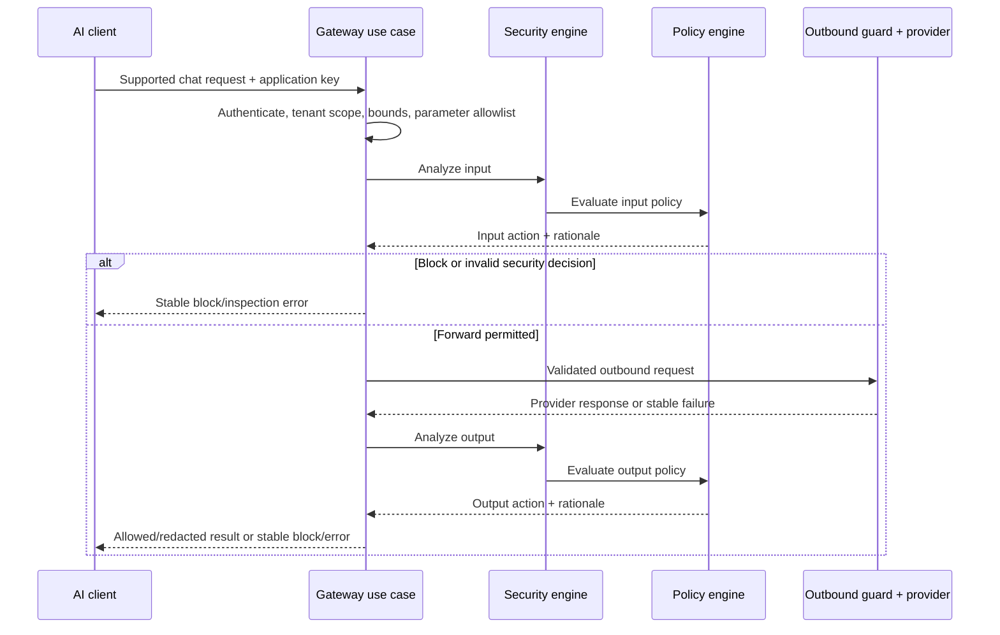

# Gateway and provider architecture

## Bounded V1 compatibility

The sole V1 compatibility target is non-streaming `POST /v1/chat/completions` with textual system/user/assistant messages and an explicit allowlist of common generation parameters. Unsupported fields and modes receive stable validation errors; unknown fields are not silently forwarded. Streaming, advanced tool/function execution compatibility and full OpenAI parity are deferred. Text may still be scanned for tool-manipulation indicators.

Gateway auth uses an environment-scoped application key; the environment selects fail-safe policy, provider and relevant security configuration. Gateway always runs input security before provider forwarding and output security before returning provider text. No security decision is delegated to the provider. Privacy filtering applies to event persistence and observability separately from the response policy.

## Failure taxonomy

| Failure | V1 behavior | Operational record |
|---|---|---|
| Optional AI incident intelligence unavailable | Deterministic analysis and policy continue. | Safe provider failure metric/event. |
| Inspection cannot produce a valid decision | Staging/production fail closed by default; development can explicitly opt into a less restrictive setting. No fabricated “safe” finding. | `inspection_failure` with request ID, environment and safe cause category; audit config changes. |
| Upstream provider timeout/error/unreachable | Stable `provider_timeout` or `provider_error`; never bypass input/output controls or return unchecked provider text. | Failure metric/event without credential or raw content. |
| Unsupported gateway payload | `validation` error; no provider call. | Bounded rejection metric. |
| Policy block | `policy_block` with safe rationale; no forwarding for input block, no raw output for output block. | Security event according to privacy policy. |
| Invalid provider configuration | `configuration_error`, fail request safely. | Audit config changes and safe diagnostics. |

Stable machine-readable codes, safe messages and correlation IDs are shared with [backend error architecture](05-backend-architecture.md). Phase 3 fixes exact HTTP mappings and payload schemas.

## Provider port and lifecycle

Core gateway and optional `ai_intelligence` depend on a provider port with operations conceptually equivalent to `validate_configuration`, `check_health`, `forward_chat`, and `normalize_response`. Implementations support remote OpenAI-compatible endpoints and explicitly permitted self-hosted compatible endpoints, including Ollama where compatible. The port translates provider errors into Renzai codes. Model, base URL, timeout settings and safe metadata are tenant-scoped configuration; API keys are encrypted at rest, decrypted only within the outbound adapter, and never returned or logged. Health validation is a separate bounded operation; it cannot authorize a later unsafe URL.

Retries are limited to idempotent validation/read operations or explicitly safe cases. Automatic retry of a chat completion risks duplicate provider billing/output; default V1 design is no automatic completion retry unless Phase 3 defines a proven idempotency contract. Connect/total timeout and response-size ceilings are mandatory. A provider response is untrusted, validated and output-scanned before any user-facing return.

## Shared outbound SSRF guard

Provider and webhook adapters use one outbound policy component. Remote targets default to HTTPS. Reject URL-embedded credentials, unsupported schemes, unexpected ports, loopback, RFC1918/private, link-local, multicast, unspecified and metadata-style destinations. Apply equivalent IPv4 and IPv6 checks, including mapped IPv4 addresses. Validate the hostname at configuration and at each connection, resolve DNS through controlled logic, validate *all* resolved addresses, and bind the connection to a validated destination to reduce DNS rebinding exposure. Every redirect target is revalidated; unsafe or excessive redirects fail. Proxy environment variables must not silently route traffic around the guard; production outbound proxy use requires explicit configuration and a compatible policy enforcement point.

An operator may opt into a narrowly scoped self-hosted local/private provider exception (such as Ollama) with approved destination and network boundary. The exception does not weaken webhook destinations by default and is logged/audited. DNS rebinding, network routing and proxy behavior still leave residual risk; egress firewall policy and deployment review complement application checks. See [ADR-014](../adr/ADR-014-ssrf-safe-outbound-networking.md).
