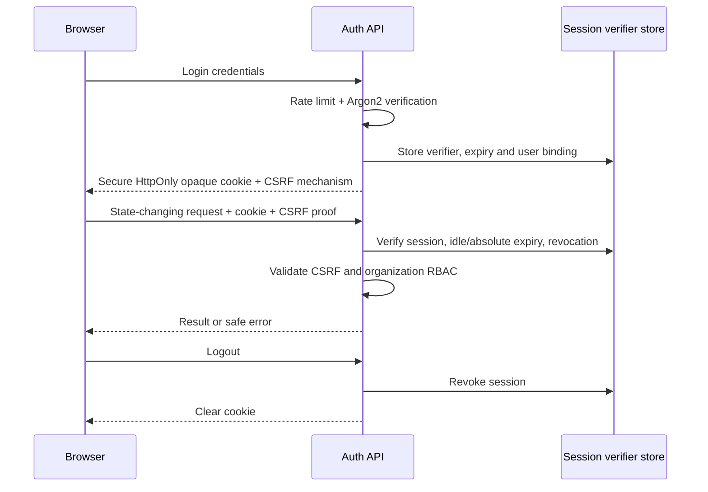
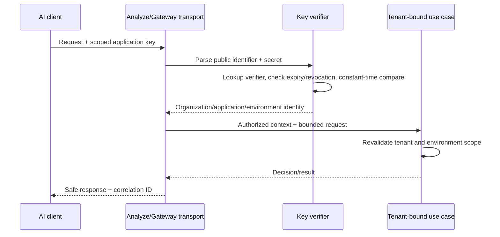

# Authentication, tenancy and security boundaries

## Dashboard sessions

Dashboard authentication uses a cryptographically random opaque session credential delivered in a Secure, HttpOnly cookie. The server stores a keyed verifier/hash and session metadata (user, created/last-seen time, absolute/idle expiry, revocation state), not the plaintext credential. Select a robust verifier construction and secret-rotation process in Phase 3; verifier lookup must not expose the credential and secret comparisons use constant-time operations where applicable. Sessions rotate on login and privilege elevation; logout and password reset revoke relevant sessions. Idle and absolute timeouts are both enforced. Cookie SameSite and scope will be chosen for supported deployment origins; they do not replace CSRF tokens on state-changing requests.

Registration, change/reset password and optional email verification use time-bounded one-time or safely lifecycle-controlled credentials; reset responses do not enumerate accounts. Invitations produce a time-bounded link even without SMTP. Brute-force protection covers login, reset and token redemption. SMTP, when configured, delivers links but does not own token validity. No browser JWT is the V1 default.

## Application API keys

Application keys are distinct from user sessions and cannot authenticate dashboard actions. They bind to one organization, application and environment, with optional expiry and revocation. A key format concept is `public lookup identifier + high-entropy secret` with a visible non-secret prefix; `rz_live_…`/`rz_test_…` are illustrations only, not approved final prefixes. Creation returns the secret once. Store only a keyed/non-reversible verifier and metadata (prefix, scope, created/last-used/expiry/revoked). Lookup by public identifier, then compare a derived verifier in constant time where relevant. Rotation creates a new credential and revokes the old one according to a documented cutover rule; revocation/expiry must reject use immediately. Last-used updates may be batched only if the UI accurately describes their granularity.

## Tenant isolation

Hierarchy: `User ↔ Membership → Organization → Application → Environment`. A user may hold a different role in each organization. The server derives tenant context from a verified session plus membership or from the verified application key; client-supplied organization IDs are selectors, never proof of access. Every repository query and service operation includes tenant scope; object identifiers are opaque but are not authorization. Cross-tenant resources produce hidden/not-found or authorization errors according to a consistent safe policy. The last Owner invariant is transactional.

Background jobs carry validated organization ID, actor/service identity, object IDs and correlation ID; workers re-fetch and reauthorize current scope before acting. PostgreSQL rows, Redis keys, outbox events, audit entries, log queries, analytics and notifications all carry tenant identity. Cache keys include tenant and permission context; shared caches must not return one organization's results to another. Administrative operations are audited. The role matrix in [Phase 1](../phase-01/03-personas-and-actors.md) is the authority; frontend role visibility does not grant access.

## Concise security boundary rules

1. Client tenant IDs never suffice for authorization; server derives and checks scope.
2. Application API keys never become user-session credentials.
3. Provider credentials and raw prompt values never enter normal logs or metrics.
4. AI explanations never become deterministic evidence or sole enforcement authority.
5. Provider failure never bypasses input/output inspection; invalid inspection fails closed by default in staging/production.
6. Private/local provider access requires explicit self-hosted opt-in.
7. Worker jobs carry validated tenant context and revalidate before side effects.
8. RBAC is server-side; UI controls only improve usability.
9. Audit events append; corrections create later events.
10. Every outbound provider/webhook request uses the SSRF guard.
