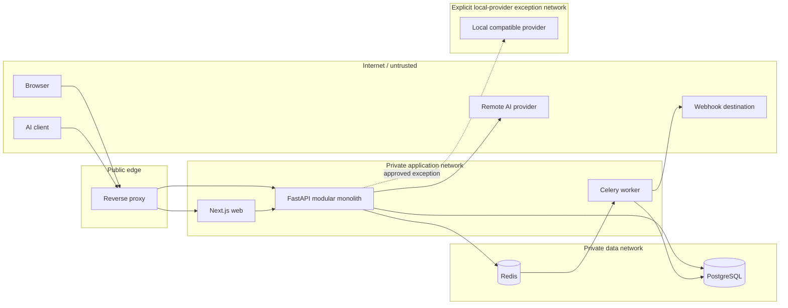

# Data flow, privacy and trust boundaries

## Trust-boundary map

| Crossing | Data crossing | Control and failure rule |
|---|---|---|
| Internet/browser → proxy | Session cookie, CSRF proof, UI inputs | TLS, bounded size, cookie/CSRF checks, rate limits. Browser is never trusted for RBAC. |
| AI client → proxy/API | Application key, prompts/responses, chat parameters | TLS, key verification, tenant scope, payload bounds, input validation. |
| Proxy → web/API | Routed request and client metadata | Trusted proxy headers only from configured proxy; request/correlation ID created/validated. |
| API → PostgreSQL | Session verifier, organization data, redacted security records, audit/outbox | Parameterized queries, tenant predicates, encryption for provider credentials, least privilege. |
| API → Redis → worker | Job identity, tenant ID, safe references, correlation ID | No raw prompt by default; private network, authentication, revalidation/idempotency. |
| API/worker → remote provider | Allowed gateway content or explicitly requested AI incident context | SSRF guard, encrypted credential use, content minimization, timeouts, response scan. |
| Worker → webhook/SMTP | Signed event payload or invitation link | SSRF guard for webhooks, timestamp/signature, replay guidance; SMTP optional. |
| API → local provider exception | Allowed content, configured model | Explicit self-hosted opt-in, exact destination/network policy, audit; never general private-network access. |

The eleven named trust surfaces are Internet, browser, reverse proxy, API, PostgreSQL, Redis, worker, remote AI provider, webhook destination, local-provider exception network, and observability export. They remain distinct boundaries even when components are co-located. Only safe metadata and aggregates cross into observability.

## Privacy flow

Before persistence, the owning use case applies the application's selected storage policy. V1 defaults are redacted content, 30-day retention and no safe prompt/response content persistence. Full-content mode requires an explicit authorized choice. Metadata-only mode stores event metadata and safe findings without raw prompt/response. Redacted mode replaces sensitive spans with typed non-reversible placeholders (`[REDACTED:EMAIL]`, `[REDACTED:PHONE]`, `[REDACTED:API_KEY]`, `[REDACTED:SECRET]`) and separate finding metadata. Original values are not kept simply to recreate a UI view. Redaction coverage is imperfect; tests and documentation must address false negatives.

For safe events, content is discarded by default after synchronous analysis, while operational/security metadata may remain under documented policy. Incident evidence can be less complete under metadata-only or safe-content non-persistence; the UI should state this instead of recovering raw content from traces. Retention cleanup covers security events and derived content/aggregates according to their policy; audit retention needs a distinct documented governance decision so deletion does not silently destroy accountability. Deletion jobs must be idempotent and tenant-scoped, with visible failures.

Gateway forwarding and optional AI intelligence can send content to a configured provider even when Renzai's storage mode is redacted or metadata only. The UI and operator documentation must make that disclosure clear. Optional AI incident analysis receives a minimized, privacy-approved incident snapshot; it cannot secretly retrieve discarded raw content. Provider output is untrusted and output-scanned before return. Prompt content never enters normal operational logs, metrics or traces.

## Architecture-level data ownership catalog

This catalog names concepts, not tables or schemas. Only the owner writes; readers use owning-module interfaces.

| Owner | Concepts | Allowed readers / writers | Retention sensitivity and scope |
|---|---|---|---|
| auth/users | User identity, session verifier, reset/verification credentials | Auth owns writes; membership/use cases read identity status | Personal/secret; user scope, session expiry |
| organizations/memberships | Organization, role, invitation | Authz and authorized modules read; owners write | Tenant root; invitation expiry; audit changes |
| applications/environments/api_keys | Application, environment, privacy config, key verifier/metadata | Gateway/security read scope; owning modules write | Tenant/application/environment; key secret never persisted |
| security/detectors/risk/policies | Findings, detector/profile versions, policy definitions/decisions | Incidents/logs/gateway read safe snapshots; owning modules write | May contain sensitive evidence; tenant and retention scoped |
| incidents | Incident, assignment, comments, timeline | Analytics/notifications read safe events; incidents writes | Tenant-scoped investigation evidence, retention policy |
| logs | Security event records | Analytics and authorized query use cases read; logs writes | Storage mode and retention apply |
| providers | Base URL, model, encrypted credential reference | Gateway/AI intelligence read via provider port; providers writes | Secret; tenant-scoped, controlled export |
| audit | Append-only audit events | Authorized audit query reads; audit append only | Tenant-scoped; retention needs explicit governance design |
| notifications | In-app items, webhook destination/delivery state | Recipient reads; notifications writes | Tenant/recipient scoped; URL/signing secret protected |
| analytics | Aggregates and freshness metadata | Dashboard reads; analytics writes | Tenant/time scoped; never raw prompt |
