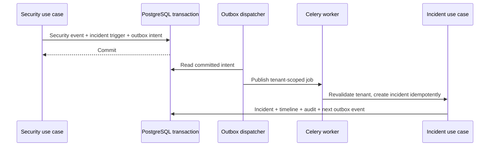
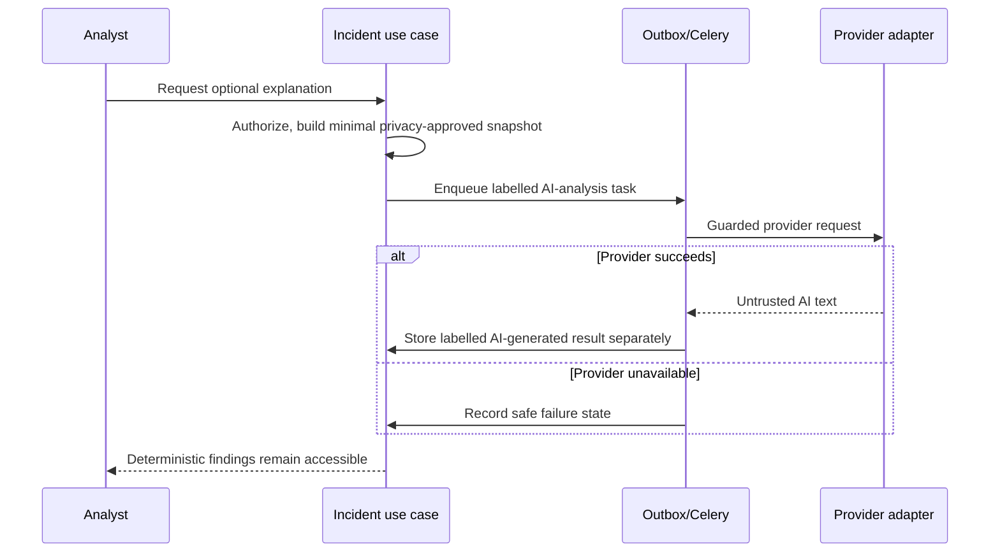
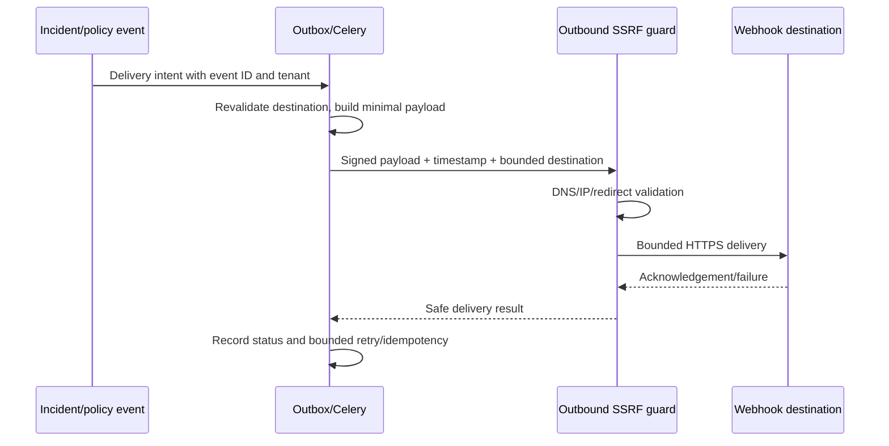

# Runtime, events and background jobs

## Sync versus async

Synchronous: authentication, key verification, analyze response, gateway input and output inspection, risk and policy decisions, privacy-filtered security record acceptance. These paths cannot wait for Celery. Asynchronous: optional AI incident explanation, in-app notification fan-out, webhook delivery, retention cleanup and analytics aggregation. SMTP delivery is optional async work; invitation token issuance is synchronous. Heavy assessment work is a later-scope idea.

Celery uses Redis as the intended broker. A queued job carries a stable job/event ID, organization ID, safe object reference, actor/service identity, correlation ID, attempt count and config/profile version references. Workers revalidate tenancy, authorization and current object state before side effects. Sensitive source content is fetched through owning interfaces under privacy policy, not copied into task payloads. Each job has a timeout; retries use bounded exponential backoff only for classified transient failures. Idempotency keys prevent duplicate notifications/incidents/deliveries. Exhausted work enters a visible failed/dead-letter state for operator review; it is never silently dropped. Queue availability does not determine synchronous security outcomes.

## Application events and outbox decision

Events are typed in-process application facts, not a distributed event bus. Proposed events: `ThreatDetected`, `IncidentCreated`, `IncidentStatusChanged`, `PolicyChanged`, `ApiKeyRotated`, `WebhookDeliveryRequested`, `RetentionCleanupRequested`. The owning use case creates the event. Synchronous consumers enforce invariants before commit; asynchronous consumers process an outbox record after commit. V1 recommends a transactional PostgreSQL outbox for durability when an incident/audit change must later trigger notifications or analytics. Without an outbox, a successful DB commit followed by queue publish failure loses the side effect. The dispatcher may deliver at least once, so consumers must be idempotent. Exact outbox storage/schema and polling method belong to Phase 3.

Webhook signatures bind event ID, timestamp and payload using a rotating organization-specific signing secret. Receivers verify signature and freshness, and deduplicate event IDs; exact wire format is Phase 3. The worker treats redirects as fresh untrusted destinations and rechecks SSRF policy on each hop.

## Audit model

An append-only audit concept includes event ID, organization ID, actor and actor type, action, resource type/ID, timestamp, request/correlation ID and safe metadata. Correction appends a later event. Audit reads follow the Phase 1 role matrix; writes are server controlled. Audit records are not cryptographically immutable in V1; restricted DB permissions, backup, monitoring and later tamper-evidence options reduce risk. Audit privacy and retention must be specified separately from prompt-content retention before schema work.
