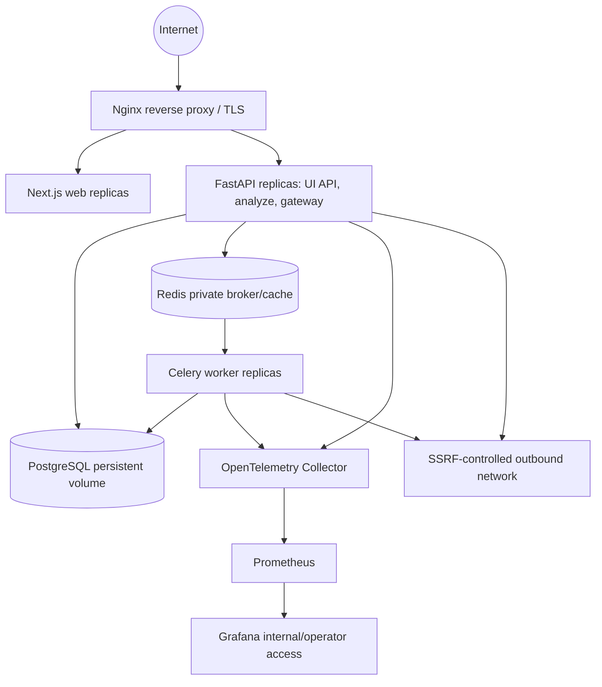

# Self-hosted deployment architecture

V1 targets Linux and a Docker/Compose deployment described here conceptually. Only reverse-proxy HTTP(S) ingress is public. Web, API, worker, PostgreSQL, Redis and observability components run on restricted networks; PostgreSQL/Redis must not be exposed to the Internet. Nginx is the intended reverse proxy. GitHub Actions is the intended future CI direction, not a Phase 2 artifact.

## Operations rules

- TLS terminates at the trusted proxy. Proxy forwarding headers are accepted only from that proxy; Secure cookie semantics must survive reverse-proxy routing.
- Web/API can scale horizontally with shared PostgreSQL session-verifier state and coordinated rate-limit state. Workers scale separately by queue; neither changes the modular-monolith domain boundary.
- PostgreSQL and Redis need authenticated, internal-only connectivity. PostgreSQL has durable storage, backup/restore procedures and controlled migration execution in a later phase. Redis is transient and must not be the sole durable audit/outbox store.
- Secrets (session verifier key, encryption keys, provider credentials, webhook signing material, database credentials) come from protected deployment inputs or later secret-manager integration; no example real credentials are checked in. Key rotation and recovery require an operator runbook before release.
- Health reports process availability with minimal disclosure; readiness checks security-critical configuration and required stores. Startup validates configuration and does not claim ready until required dependencies are usable. Exact endpoint behavior is Phase 3 API work.
- Provider and webhook egress passes through the outbound guard and deployment firewall/proxy policy. Local/private provider exceptions use explicit self-hosted configuration and a restricted network route.
- Development may use local convenience settings only with explicit opt-in. Staging/production fail closed on invalid security inspection and use restrictive CORS, CSRF and outbound defaults. Provider-forwarding errors never bypass controls.
- Observability endpoints and Grafana are internal/operator-only. Monitoring failure must be visible but cannot grant access or disable enforcement.

The design does not claim high availability or disaster recovery. Capacity, exact timeouts, backup objectives, resource limits and Compose topology are later operational decisions. No Docker, Compose, Nginx, CI or deployment file is created in this phase.
