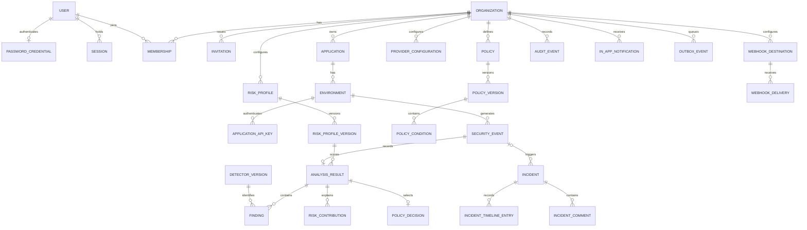

# Logical data model and database rules

This is a conceptual model, not SQL or an ORM schema. [Entity contracts](03-entity-contracts.md) define ownership and lifecycle; the diagram shows primary relationships. `SecurityEvent` is the durable privacy-filtered event; an `AnalysisResult` is the canonical decision snapshot and may exist transiently when safe content is not stored.

`PolicyVersion`, `RiskProfileVersion`, detector reference and `AnalysisResult` are versioned/snapshot concepts. `AuditEvent` and `IncidentTimelineEntry` are append-only. `Session`, reset/verification/invitation tokens are short-lived credentials. `OutboxEvent` and `WebhookDelivery` are mutable delivery state without raw content. Incident creation can be manual, so its triggering event is nullable. A security event may produce several related incidents only if an explicit idempotency discriminator differs; default automatic trigger is one incident per `(organization_id, event_id, rule_id)`.

## Identifier choice

V1 entity IDs use **UUIDv7**, generated by the application and stored as PostgreSQL UUID values. Compared with UUIDv4, time-ordered UUIDv7 improves insert locality and chronological listing; compared with ULID, it avoids a custom text representation for PostgreSQL. Creation timestamps, not ID order alone, remain the authoritative sort key. UUIDv7 exposes approximate creation time and is potentially guessable in sequence; neither IDs nor pagination cursors are authorization secrets. Public lookup tokens for keys/sessions are independently random and are not UUIDv7.

## Tenant and relationship invariants

- Organization-scoped roots carry `organization_id`; children either carry it redundantly with a composite foreign-key/consistency invariant or derive it through a parent with an enforced same-tenant relation. Critical join paths (incident→event, finding→analysis, key→environment, provider→environment) must not allow cross-organization references.
- Every list/read/update/delete query combines object ID with server-derived `organization_id`. User membership is checked before forming tenant context; a client-supplied organization ID is only a selector. Workers re-fetch scope and status before side effects. Analytics, caches, outbox and notifications retain tenant identity.
- Unique constraints: normalized email globally; `(organization_id, user_id)` membership; organization slug globally if exposed; application name within organization; environment type within application; key public lookup globally; policy priority within `(organization_id, scope_kind, scope_id, phase)` for non-archived policy identities; `(policy_id, version)` and `(risk_profile_id, version)`; outbox event ID; `(destination_id, event_id)` delivery.
- Scope roots must belong to their parent: application to organization, environment to application, key/event to environment, incident to event when present, policy/provider/webhook to organization. Transactions enforce the last Owner invariant and policy-priority swaps without a transient duplicate.
- PostgreSQL Row-Level Security is **defense-in-depth deferred from the V1 baseline**. It can be added after role-aware API/worker tests and connection-context design. V1 relies on server authorization, tenant-scoped repositories and database relationship constraints; RLS alone would not replace RBAC.

## Conceptual indexes and lifecycle

Plan indexes for `(organization_id, created_at, id)` lists; incidents by `(organization_id, status, created_at)`; events by organization/application/environment/time and selected filter dimensions; audit by organization/time; session and API key public lookup; outbox state/available time; webhook delivery by destination/state/time. Validate read/write cost and cardinality before migration design.

Archive applications and policy identities; preserve immutable policy/profile versions used by historical decisions. Revoke keys and sessions rather than silently deleting active credential history. Retention-delete security events and derived sensitive content; audit follows its separate 365-day default. Disabled/deleted provider configuration must leave a safe audit trail without retaining plaintext credentials. A generic `deleted_at` on every entity is explicitly avoided.
