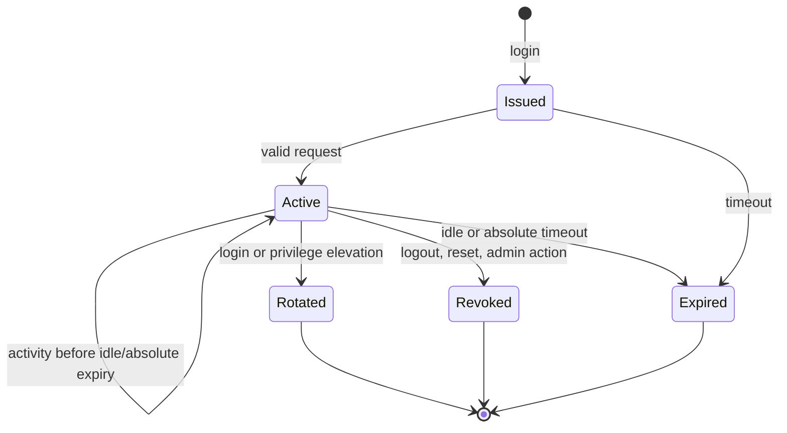

# User, authentication, session and token contracts

## User aggregate

`User` exposes `user_id`, `email`, `normalized_email`, `status=active|disabled`, `email_verified_at|null`, `created_at`, `updated_at`; its auth-owned `PasswordCredential` has `password_hash`, algorithm/parameters version and `changed_at`. Normalize email using a documented Unicode/case policy before uniqueness checks; display spelling may be preserved separately. Disabled users cannot log in or keep valid sessions. Registration/reset responses avoid account-existence disclosure. Passwords are never stored or logged in plaintext and use Argon2-class hashing.

## Opaque session

Session cookie name is `__Host-renzai_session` when served over a single HTTPS origin: Secure, HttpOnly, Path=/, no Domain, SameSite=Lax. Cross-origin dashboard deployment would require an explicit reviewed cookie/CSRF variant; the V1 default is same-origin. Credential: 256 random bits encoded URL-safe. Store only a random public lookup ID, keyed verifier/HMAC of the secret, `user_id`, `created_at`, `last_seen_at`, `idle_expires_at`, `absolute_expires_at`, `revoked_at`, `privilege_version`, and minimal safe client metadata. Verifier-key ID allows rotation; no plaintext session credential is stored.

Proposed configurable V1 defaults: idle timeout **30 minutes**, absolute timeout **12 hours**, no persistent “remember me”. Each accepted request refreshes `last_seen_at` and idle expiry without exceeding absolute expiry; a later implementation may throttle writes only if it preserves these semantics across replicas. Login and privilege elevation issue a fresh session and revoke the prior one. Logout revokes server state before clearing the cookie. Password reset revokes all user sessions; password change revokes other sessions and rotates the current one. Membership changes increment a privilege epoch; every request checks current membership, so removed/downgraded access stops immediately, and changed sessions re-bootstrap/rotate. Expired/revoked rows are cleaned after a short operational grace window without extending validity.

## CSRF and browser boundary

`GET /api/v1/auth/session` returns session bootstrap data and a random CSRF token to the same-origin browser; the server stores only its session-bound verifier. Browser JavaScript holds the CSRF token in memory and sends `X-Renzai-CSRF` on cookie-authenticated POST/PATCH/PUT/DELETE requests. The server checks session binding, token verifier in constant time where applicable, and allowed `Origin` (or same-origin Referer fallback under a documented proxy setup). Rotate the token with the session and after privilege changes. Login/register/reset requests without an existing session use strict same-origin Origin/Referer checks and rate limits; login issues fresh session/CSRF material. Secure/HttpOnly cookies and SameSite do not replace CSRF validation. Application-key requests do not use browser CSRF semantics.

## Reset, verification and invitation credentials

All three flows use a random public lookup plus 256-bit secret, store only a keyed verifier with key ID, enforce expiry and one-time redemption, and rate-limit issuance/redemption. Defaults, configurable within hard ceilings: password reset **30 minutes**, email verification **24 hours**, invitation **7 days**. Reset request always returns the same safe acknowledgement; successful reset changes password and revokes sessions/tokens. Email verification is optional by self-hosted configuration. Invitation creation works without SMTP; the authorized creator receives a one-time link. If SMTP is configured, the same token flow may be delivered by email. Invitation redemption binds target organization, role and intended email; acceptance creates/activates membership transactionally and consumes token. Reissue/revoke invalidates earlier outstanding tokens for the same target where policy requires. Do not place tokens in normal logs or referrer-bearing pages.

## Specification vectors

- Given correct credentials, login issues a new cookie and session verifier; session bootstrap returns the same user and CSRF token, while the cookie is unreadable by browser JavaScript.
- Given a session idle for more than 30 minutes or older than 12 hours, the next authenticated request returns `authentication` and clears/invalidates state.
- Given a role downgrade, a previously loaded UI may remain visible, but the next protected request uses current membership and denies the old capability.
- Given an unknown email, password-reset request returns the same public acknowledgement as a known email.
