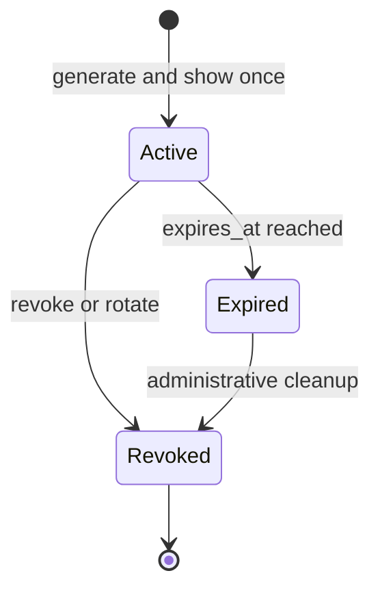

# Application API-key contract

## V1 format and storage

Finalize the key as `rz_<env>_<lookup>_<secret>` where `<env>` is `dev`, `stg`, or `prd`; `<lookup>` is 128 random bits in unpadded base64url (22 characters); `<secret>` is 256 random bits in unpadded base64url (43 characters). The visible non-secret prefix is `rz_<env>_<first 8 lookup characters>`. Neither section encodes organization/application IDs. The environment tag is advisory for humans; authorization always uses stored scope. The complete key is returned exactly once over the authorized creation/rotation response and is never retrievable again.

Store globally unique lookup, prefix, key ID, organization/application/environment IDs, keyed verifier/HMAC of the secret with verifier-key ID, creator, `created_at`, optional `expires_at`, `revoked_at`, and `last_used_at`. Do not store plaintext secret or complete key. The verifier key is separate from provider encryption and session-verifier keys. Parse exact format and fixed lengths, look up by public part, check stored environment/expiry/revocation, compute verifier, and compare in constant time. Unknown lookup paths should perform equivalent bounded work to avoid obvious timing leaks where practical. Rate limits protect guessing even though entropy is high.

## Lifecycle

Issue only for active application/environment with Owner/Admin/Developer permission. `expires_at` may be null; if set, it must be in the future and within a configured maximum. `last_used_at` is the timestamp of the last successful authentication, recorded with documented eventual granularity (target no more than five minutes of lag). Revocation is effective for the next verification; caches must invalidate or recheck status. Rotation atomically issues a replacement and revokes the old key by default; the response shows the replacement secret once. A failed delivery cannot recover that secret: the user may revoke the unseen new key and rotate again. Key metadata remains for audit/retention as permitted; archived applications reject new traffic and keys.

Application-key creation/rotation deliberately does **not** replay secret responses via `Idempotency-Key`: replay would weaken one-time display. Clients must not automatically retry these operations after an uncertain response; they can inspect metadata, revoke the uncertain key and create a new one. Revoke is idempotent. This differs from safe outbox/webhook deduplication.

## Vectors

- A newly created key authenticates only its stored environment, appears once in the creation response, and later lists show prefix/metadata only.
- Revoked and expired keys fail on the next request; a key from another organization cannot select a foreign environment.
- Two keys may share the same visible eight-character prefix; full random lookup remains unique and is the sole lookup key.
