# Security analysis and event contracts

The Analyze API, Gateway input/output phases and Playground share one deterministic pipeline: bounded validation → normalization → versioned detectors → finding aggregation → versioned risk profile → policy evaluation → action. Optional AI intelligence is separate and never an enforcement prerequisite. Invalid inspection returns an error, never a fabricated no-finding result.

## Canonical result

All JSON field names are `snake_case`; timestamps are UTC RFC 3339, IDs are UUID strings. The conceptual successful result is:

```json
{
  "analysis_id": "<uuidv7>",
  "timestamp": "<utc-rfc3339>",
  "direction": "input",
  "source": "analyze",
  "safe": true,
  "no_detected_threat": true,
  "action": "allow",
  "risk_score": 0,
  "severity": "low",
  "confidence": 0,
  "risk_profile": { "id": "<uuidv7>", "version": 1 },
  "detector_ruleset_version": "1.0.0",
  "findings": [],
  "risk_contributions": [],
  "policy_decision": { "policy_match": null, "evaluated_policy_versions": [], "rationale_code": "no_policy_matched" },
  "correlation_id": "<request-id>"
}
```

This is a coherent no-finding/no-policy-match example. Use the [worked vectors](09-risk-scoring-specification.md) and [policy contract](10-policy-contracts.md) for other outcomes. `safe` and `no_detected_threat` both mean **a valid completed inspection found no detector finding and scored 0**; they are observational labels, not guarantees of harmlessness and do not override a context-based policy action. Errors contain neither field. `confidence` is confidence in the highest contributing finding (0 if none), not confidence that traffic is safe.

`action` is one of `allow|flag|block|redact|require_review`. `risk_profile.id/version`, detector versions and evaluated policy versions identify exact decision inputs. A successful no-policy match always returns `allow`, `policy_match=null` and rationale `no_policy_matched`, even if findings and score are nonzero. An invalid inspection returns `inspection_failure`; staging/production Gateway fails closed. Analysis result serialization filters evidence to the caller's role and privacy mode.

## SecurityEvent persistence

`SecurityEvent` is privacy-filtered metadata for an Analyze/Gateway/Playground analysis: `event_id`, `organization_id`, `application_id`, `environment_id`, `direction=input|output`, `source=analyze|gateway|playground`, `occurred_at`, `correlation_id`, `privacy_mode`, `content_ref|null`, `analysis_id`, `risk_profile_id/version`, selected policy snapshot/version or null, `action`, `incident_id|null`, safe error category when applicable. A gateway turn may produce linked input and output events under one correlation ID. An output event is absent if input was stopped before provider forwarding. Full content is optional; default safe events keep no prompt/response content. Metadata and safe findings may still be recorded under retention policy.

```mermaid
flowchart LR
  Request[Bounded input/response] --> Normalize[Normalize with version]
  Normalize --> Detectors[Versioned detectors]
  Detectors --> Findings[Privacy-safe findings]
  Findings --> Risk[Profile ID/version and contributions]
  Risk --> Policy[Policy snapshot and action]
  Policy --> Result[Canonical AnalysisResult]
  Result --> Privacy[Storage-mode filter]
  Privacy --> Event[SecurityEvent metadata]
  Event -. configured trigger .-> Incident[Incident/outbox intent]
```



## Analysis API contract

`POST /api/v1/analyze` requires an environment-scoped application key. Request: `direction=input|output`, `content` bounded text, optional `correlation_id` and request metadata from an allowlist. Application/environment come from the key, not free client IDs. Response: canonical result and applicable `redacted_content` only for `redact`. Playground reuses the same analysis use case through a session-authenticated route with `source=playground`, never a machine key in browser JavaScript. An explicit direction prevents treating response leakage as input risk.

## Design vectors

- No provider configured, valid prompt: detector/risk/policy execute and return a result; no `ai_generated` claim appears.
- Valid inspection, no findings, no matching policy: score 0, `safe=true`, action `allow`, `policy_match=null`, rationale `no_policy_matched`.
- Valid high-risk finding, no policy: score and finding are returned, action remains `allow` under P3-001; the rationale must not imply the content is harmless.
- Required detector/risk/policy failure: no successful result is emitted; `inspection_failure` is returned and Gateway staging/production does not forward unchecked content.
