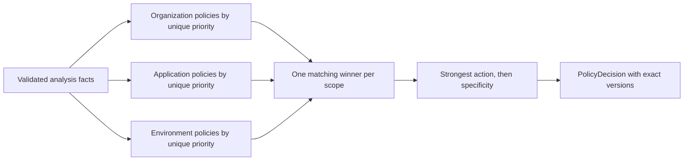

# Policy contracts and decision semantics

## Bounded policy representation

`Policy` has identity, organization, optional application/environment scope, phase (`input|output`), unique positive integer priority (1 is highest within scope+phase), enabled state and active `PolicyVersion`. `PolicyVersion` is immutable after activation and contains action (`allow|flag|block|redact|require_review`), rationale code, condition group and optional redaction targets. A condition group is one flat `all` or `any` array of 1–20 conditions; no nested groups, arbitrary scripts, regex or external calls. Allowed facts: phase, category set, detector ID set, risk score, severity, confidence band, application ID, environment type, source. Allowed operators: `equals`, `in`, `greater_or_equal`, `less_or_equal`, `contains_category`. Validate field/operator/value combinations and bounded list lengths on write.

Priority is unique for every non-archived policy identity in `(organization_id, scope_kind, scope_id, phase)`, whether currently enabled or disabled, so enabling cannot create an ambiguity. Duplicate priority on create/edit/rollback is `conflict`. A transactional swap or renumber operation must preserve uniqueness throughout commit. `scope_kind` is `organization|application|environment`; an organization scope uses one canonical scope ID, not null-comparison semantics. A version edit creates a new version; activation and rollback select an existing immutable version and append audit. A request evaluates one snapshot and stores each evaluated policy ID/version.

## Inheritance and precedence

Evaluate the current phase at organization, application and environment scopes. Within each scope, scan enabled policies by ascending unique priority and select the **first matching** policy at that scope. No match at a scope contributes nothing. Combine the at-most-three scope winners by safety rank `block > require_review > redact > flag > allow`. The strongest action wins. If equal rank, the more specific environment/application policy is the selected `policy_match`; all winners remain in `scope_winners` and rationale. A narrower `allow` **cannot weaken** a parent block/review/redact/flag. An organization allow can still be strengthened by an application/environment rule. This gives deterministic inheritance without silently overriding a parent safeguard.

Only if **no enabled policy matches at any scope** and inspection completed validly, return `action=allow`, `policy_match=null`, `scope_winners=[]`, `rationale_code=no_policy_matched`, plus findings and risk. This is P3-001, not an inspection fallback. `PolicyDecision` records phase, selected policy/version or null, all evaluated versions, scope winners, action, rationale, profile version and timestamp. A malformed active policy or inability to evaluate returns `inspection_failure`, not `allow`.

## Action and review behavior

- `allow`: normal processing; any findings/risk remain visible.
- `flag`: normal processing with flagged security event/optional incident trigger.
- `block`: Analyze returns the action; Gateway input is not forwarded and Gateway output is withheld.
- `redact`: replace only detector-provided, validated sensitive spans with typed non-reversible placeholders. Input redaction occurs before forwarding; output redaction occurs before return. A matching redact policy without safe redaction targets yields `inspection_failure` in Gateway rather than unchecked content.
- `require_review`: Analyze returns this action directly. Gateway input is not forwarded; Gateway output is not returned. Both phases return the same `review_required` machine code and a safe phase indicator, durably create or queue an incident according to the policy, optionally queue notification, and never hold HTTP open for human review. This is not a confirmed-malicious `policy_block`.

## Decision vectors

| Matches | Expected action and selected match |
|---|---|
| None after successful inspection | `allow`, null, `no_policy_matched` |
| Org block priority 10; app allow priority 1 | `block`, org block; app cannot weaken |
| Org flag priority 10; env redact priority 20 | `redact`, env redact; both winners recorded |
| App block priority 10; env require_review priority 1 | `block`, app block; both recorded |
| Two policies in same effective scope/phase with priority 10 | Write rejected `conflict`; no runtime tie |
| Active policy cannot be parsed/evaluated | `inspection_failure`; no successful decision |

Policy permission follows the Phase 1 role matrix. All policy changes, activation, disablement and rollback are audited. The preview/editor must show inheritance and the effective strongest action before activation. Historical decisions retain references to exact policy versions.
