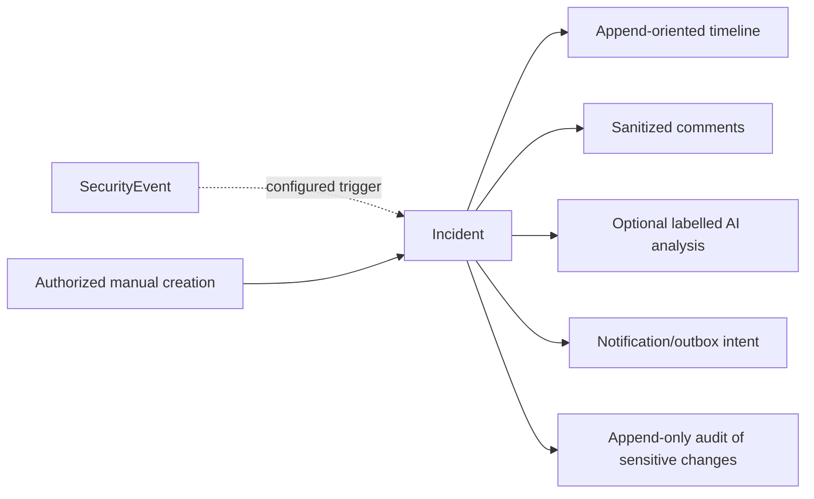

# Incident, timeline and audit contracts

## Incident

`Incident` includes `incident_id`, `organization_id`, `application_id|null`, `environment_id|null`, `triggering_event_id|null`, severity, status, title and safe summary, `assignee_user_id|null`, `created_at`, `updated_at`, `resolved_at|null`, and resolution category. Status enum: `open`, `investigating`, `resolved`, `ignored`, `false_positive`. New incidents start `open`. `open → investigating|resolved|ignored|false_positive`; `investigating → open|resolved|ignored|false_positive`; terminal states may reopen to `investigating` only with an authorized, audited reason. `resolved_at` is set on terminal transition and cleared on reopen. Assignment requires active membership in the same organization. Manual incidents may omit a triggering event; automatic incident deduplication uses `(organization_id, triggering_event_id, trigger_rule_id)`.

`IncidentTimelineEntry` is append-oriented: `entry_id`, incident/organization IDs, `type`, actor type and ID (or service ID), timestamp, safe summary, correlation ID and referenced event/policy version. Types include `incident_created`, `status_changed`, `assigned`, `comment_added`, `ai_analysis_requested`, `ai_analysis_completed`, `ai_analysis_failed`, `policy_action_recorded`. `IncidentComment` carries author, sanitized bounded body and timestamp; edits, if allowed later, create a new timeline entry instead of erasing history. False Positive changes status and timeline only; it never silently retrains detectors. Corpus promotion requires explicit human review.

## AuditEvent

`AuditEvent` is append-only with `audit_event_id`, `organization_id`, `actor_type=user|application|service`, `actor_id|null`, `action`, `resource_type`, `resource_id`, UTC timestamp, `correlation_id`, and bounded allowlisted safe metadata. It covers account, membership, key, provider, policy, privacy, retention, webhook and incident changes. Corrections append a new event referencing the prior event; existing rows are not updated to rewrite history. Database and application permissions restrict mutation, but V1 does not claim cryptographic immutability.

Audit retention defaults to **365 days**, separate from the **30-day** default for security content/events. A configurable audit value is permitted within **90–3650 days** with Owner/Admin authorization and audit of the change; a release policy may narrow this range. An audit row never carries raw prompt/response, password, application key secret, provider API key, session credential or webhook signing secret. Retention cleanup may delete expired audit rows in a controlled, tenant-scoped operation; deletion itself produces safe operational evidence without preserving the deleted sensitive record.

## Review-required durability

When a Gateway policy yields `require_review`, the HTTP path withholds content and transactionally records a privacy-filtered event plus an incident or durable outbox trigger according to the policy. If this transaction cannot commit, return a safe service failure; do not forward or return unchecked content. Analyze may return `require_review` directly, while configured incident creation may be asynchronous through the outbox. Notifications are optional and cannot turn a failed security decision into allow.
