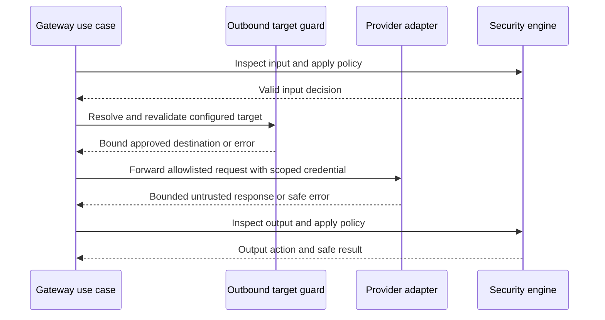

# Provider and outbound target contracts

## ProviderConfiguration

Fields: `provider_config_id` UUIDv7, `organization_id`, optional `application_id/environment_id` narrowing, name, `kind=openai_compatible_remote|openai_compatible_local`, `base_url_target`, configured model, connect/total/health timeout values, enabled, local-private exception reference/null, created/updated timestamps, last validation status/time and encrypted credential reference/null. Local compatible endpoints such as Ollama are allowed only through explicit self-hosted configuration. Name is unique within effective scope. Deletion disables the configuration and removes credential material under retention rules while preserving safe audit metadata.

Safe read responses include ID, name, kind, masked credential-present flag, model, validated target host/port/path as permitted to admins, timeout values, enabled state and validation status. They never return plaintext provider API key or ciphertext. The secret is encrypted at rest with a dedicated provider-encryption key ID; decryption occurs only inside the outbound adapter immediately before a call. Rotation stores a new ciphertext/key reference and audits change. Exact encryption implementation is deferred, but purpose separation and key-version metadata are contractual.

## Normalized outbound target

Persist a validated representation: `scheme`, IDNA-normalized lowercase hostname, port, bounded path prefix, `destination_kind`, `private_exception_id|null`, `validation_policy_version`, last validation state/time. Reject URL userinfo, fragments, query-based credential material, unsupported schemes and unexpected ports. Remote destinations default to HTTPS. Loopback, RFC1918/private, link-local, multicast, unspecified, cloud-metadata-style and equivalent IPv6/IPv4-mapped addresses are denied by default. Validate **all** DNS answers at configuration and connection; bind connection to a validated address, validate every redirect target/final address and bound response. A saved target is not a permanent authorization. Environment proxy variables cannot silently bypass the guard. A narrowly scoped self-hosted exception identifies exact local provider destination and network policy; webhook targets do not inherit it.

## Provider port and timeouts

Provider adapter operations: `validate_configuration`, `check_health`, `forward_chat`, `normalize_response`, `translate_error`. Default timeouts: connect **3 seconds**, total chat request **30 seconds**, health validation **5 seconds**; configurable within hard ceilings of 10/120/15 seconds respectively. Provider response size ceiling is [defined with payload limits](19-configuration-contracts.md). No automatic retry of chat completion by default: the upstream may have processed an uncertain request. Bounded retries may apply only to safe health validation. Raw provider errors, headers and response bodies are not returned or logged; `provider_timeout` and `provider_error` are stable Renzai classifications. Provider output is untrusted and must pass output inspection before return.

Provider health validation is a point-in-time check; it does not replace per-connection SSRF revalidation. Optional AI incident explanations use minimized privacy-approved context and are labelled separately from deterministic findings. Core analysis remains usable with no provider configured.
