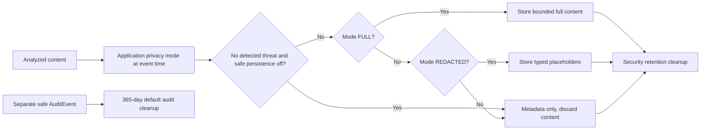

# Privacy, classification and retention contracts

## Storage mode matrix

Default per application: `REDACTED`, safe-content persistence **off**, security content/event retention **30 days**. An authorized Owner/Admin may select `FULL` or `METADATA_ONLY` and one of 7/30/90/custom days within a configured safety ceiling. The mode selected at event time is stored with the event; later changes do not silently rewrite historical content.

| Data | FULL | REDACTED (default) | METADATA_ONLY |
|---|---|---|---|
| Prompt/response | Full bounded text for non-safe events | Typed-placeholder text for non-safe events; original sensitive value discarded | No text |
| Safe prompt/response | None by default; explicit opt-in permits selected mode | None by default | None |
| Findings | Structured findings and evidence subject to role/privacy filter | Structured findings with redacted excerpt/span/classification only | Category, detector/version, severity, confidence and classification only |
| Incident | Safe metadata/timeline and available event reference; content obeys event mode | Same, with placeholders | Same, without original text |
| Correlation | IDs, timestamps, app/environment, action/profile/policy versions | Same | Same |
| Analytics | Tenant/time aggregates, no raw text | Same | Same |

Typed placeholders: `[REDACTED:EMAIL]`, `[REDACTED:PHONE]`, `[REDACTED:API_KEY]`, `[REDACTED:SECRET]`. They are non-reversible. In REDACTED mode, the original value must not survive merely to support later display. Redaction may miss data; findings and UI must not imply guaranteed safety. Operator-configured provider forwarding can disclose content to that provider even when Renzai storage is redacted or metadata only; this must be visible in configuration UX.

## Data classes and logging

| Class | Examples | Normal operational logging |
|---|---|---|
| PUBLIC | Product/version metadata and published API docs | Allowed if bounded. |
| INTERNAL | Opaque IDs, non-sensitive configuration flags, action/severity aggregates | Allowed through structured allowlist; avoid unbounded high-cardinality labels. |
| SENSITIVE | Email, prompt/response, redacted finding, incident comment, provider target | Do not log raw; emit only approved safe classifications/IDs. |
| SECRET | Password and hash, API-key/session/reset/invitation secrets, provider key, encryption key, webhook signing key | Never log or return except one-time credential issuance to authorized actor where specified. |

Telemetry (logs, metrics, traces) never includes raw prompt/response or secret material. Exception messages are sanitized. Audit metadata is allowlisted and excludes raw prompt/provider response and secrets.

## Separate retention lifecycles

SecurityEvent/AnalysisResult/Finding/incident content and derived sensitive analytics default to **30 days**, configurable 7/30/90/custom under a hard ceiling set in [configuration](19-configuration-contracts.md). AuditEvent defaults to **365 days**, configurable 90–3650 days; audit cleanup is a separate policy. Expired security content references may leave an incident with less evidence; UI shows the evidence-expired state. Outbox/job/webhook payloads must contain safe references, not a hidden second copy of raw text.

Retention cleanup runs tenant by tenant with cutoff computed from the event's recorded policy version. It is idempotent, deletes derived sensitive content and orphan-safe references, preserves audit until its separate cutoff, and records safe counts/failures. Failed batches retry with bounded backoff and alert operators; a failed delete cannot be reported as complete. Backups require a documented expiry/restore policy before release so deleted content is not silently reintroduced.

