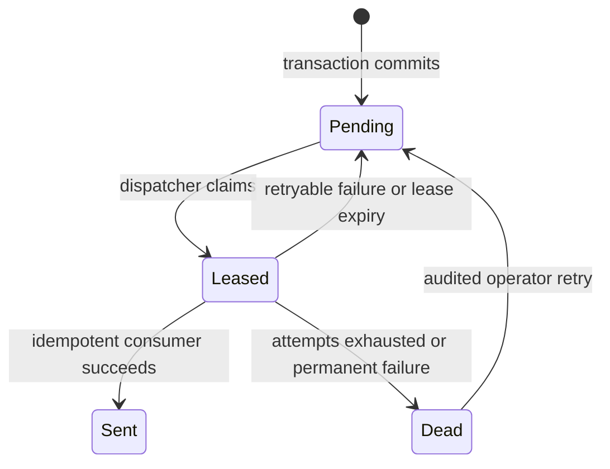

# Application events, outbox and idempotency contracts

V1 events are typed facts inside the modular monolith, not a distributed event bus. Owning use cases emit `ThreatDetected`, `IncidentCreated`, `IncidentStatusChanged`, `PolicyChanged`, `ApiKeyRotated`, `WebhookDeliveryRequested`, `RetentionCleanupRequested`, and `AIAnalysisRequested` as appropriate. The durable outbox is PostgreSQL-backed; the domain change, required audit and outbox intent commit in one transaction. Celery/Redis transports work after commit. Delivery is **at least once**, never exactly once.

## OutboxEvent

Fields: `outbox_event_id` UUIDv7, `organization_id`, `event_type`, `payload_version`, `aggregate_type/id`, safe reference/allowlisted metadata payload, `created_at`, `available_at`, `attempts`, `state=pending|leased|sent|dead`, `lease_owner|null`, `lease_expires_at|null`, `correlation_id`, and last safe failure code/null. Payloads contain no raw prompt, secret or provider response. Consumers re-fetch current tenant-scoped records and validate membership/status before side effects.

Dispatcher claims available events with a bounded lease; an expired lease returns to pending. Publishing to Redis does not mark an event complete until the consumer records successful idempotent processing. Attempts use bounded exponential backoff and jitter; exhausted attempts become `dead` with operator-visible failure. A duplicate publish is expected and harmless if consumer deduplication is correct. Exact SQL/locking design belongs to implementation, not this contract.

## Idempotency decisions

| Operation | Key and behavior |
|---|---|
| Automatic incident creation | Unique `(organization_id, security_event_id, trigger_rule_id)`; duplicate job returns existing incident. |
| Outbox consumption | `outbox_event_id + consumer_name` dedupe; processing is repeatable after crash. |
| Webhook delivery | Unique `(destination_id, event_id)`; same event ID and body reused across retries. |
| Retention cleanup | Tenant/cutoff/batch cursor; repeating a deletion is harmless, with safe count reporting. |
| Invitation creation | No replay of invitation secret. A new invitation for same target/role revokes the prior active invitation; no automatic client retry after uncertain response. |
| API-key creation/rotation | No replay of one-time secret response; no automatic client retry. Revoke is idempotent. |
| Provider completion | No automatic retry after uncertain upstream outcome; no artificial dedupe claim. |

HTTP `Idempotency-Key` is not a universal V1 requirement. For create endpoints that return only non-secret metadata, a later implementation may offer a bounded tenant/actor/request-hash dedupe window, but it must not weaken one-time secret display. No client-supplied key is trusted as tenant authorization.
