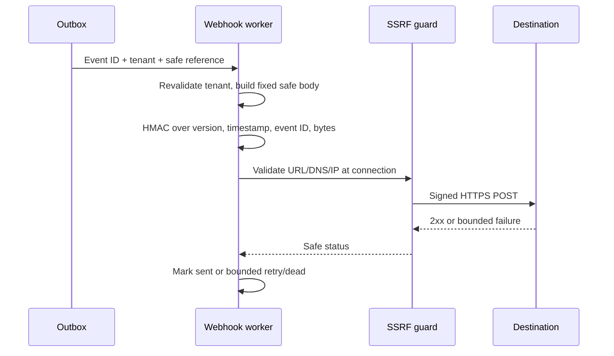

# In-app notification and signed webhook contracts

## In-app notification

`InAppNotification`: UUIDv7 ID, organization ID, recipient user ID, type, bounded safe title/body, resource type/ID, `created_at`, `read_at|null`, and expiry. Only an active authorized recipient can list/mark read. It contains no raw prompt, response, application key, provider credential or signing secret. Notifications arise from configured incident/policy events and are delivered asynchronously; failure does not alter synchronous policy action.

## Webhook destination and event

Owner/Admin may create, update, enable, disable and delete destinations within their organization. Remote URL must pass the shared SSRF guard and default to HTTPS; V1 webhook redirects are **not followed**. Local-provider private-network exceptions do not apply to webhooks. A test operation sends a fixed synthetic safe event only after rate limit and URL revalidation. Destination signing secret is randomly generated, encrypted at rest, shown once to an authorized creator/rotator, and associated with a key ID; old secret may remain verify-capable for a bounded rotation overlap.

Webhook JSON contains `event_id`, `event_type`, `occurred_at`, `organization_id`, resource reference, correlation ID and allowlisted safe metadata. No raw sensitive content by default. Headers: `X-Renzai-Event-Id`, `X-Renzai-Timestamp` (Unix seconds), `X-Renzai-Signature` (`v1=<lowercase hex HMAC-SHA256>`), and `X-Renzai-Signature-Key-Id`. Sign the exact transmitted UTF-8 body bytes with canonical input `v1\n<timestamp>\n<event_id>\n<body-bytes>`. The receiver verifies signature in constant time where applicable, accepts timestamps within **±5 minutes** of its clock, and deduplicates event IDs per destination. Canonical JSON serialization must be stable for retries; signing always uses the actual bytes sent, avoiding reserialization ambiguity.

`WebhookDelivery` keeps destination/event IDs, payload version/hash, attempts, status, next attempt/time, safe response status and last failure code. Success is any 2xx. 408/429/5xx and network timeout retry; other 4xx or redirect are terminal. Maximum **5 attempts** with backoff approximately 1, 5, 15 and 60 minutes plus bounded jitter; a terminal failure is visible to Owner/Admin. Each attempt revalidates DNS/IP and target. Response body is ignored except for bounded safe diagnostics (8 KiB ceiling); no raw body enters logs. Event identity and body stay stable across attempts. Provider/gateway completions are never retried by this mechanism.

## Signature vector specification

Given fixed secret, timestamp, event ID and exact body bytes, the HMAC input must equal the canonical byte concatenation above; changing any byte changes the signature. A receiver rejects a correct signature outside the five-minute window and rejects replay of the same event ID. Phase 4 tests must use an independently calculated digest, not the sender's signing helper as the expected value.
